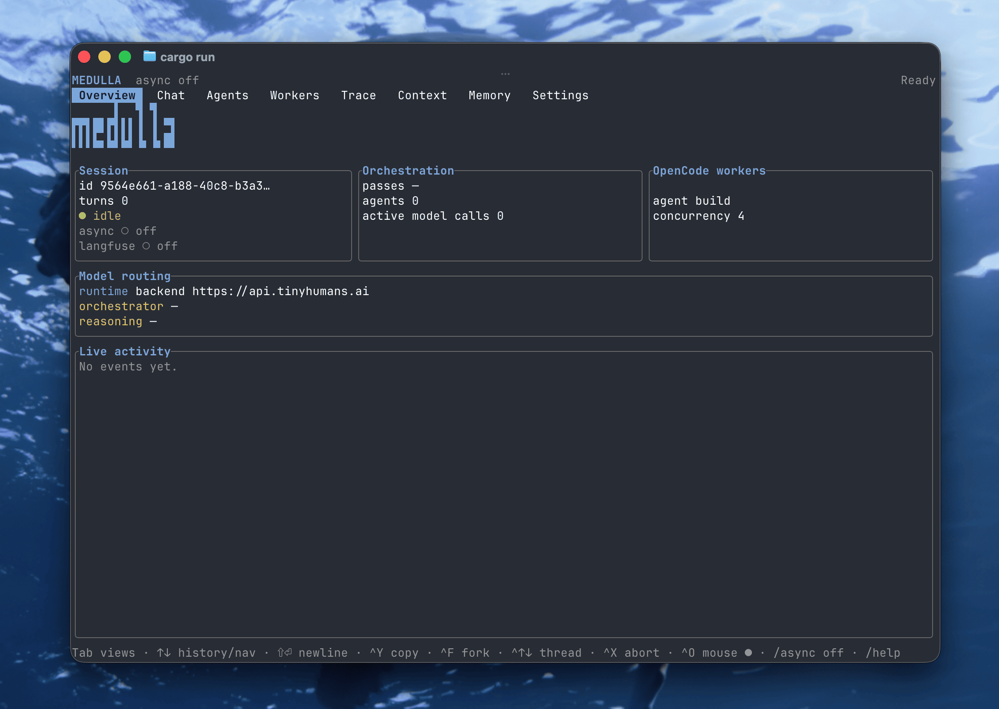

# Medulla v1: The First Orchestrator Model

Medulla v1 is the first model of its kind: not a chat model, not another agent harness, but an **orchestrator model**, purpose-built to command fleets of agent harnesses like [Claude Code](https://www.anthropic.com/claude-code), [Codex](https://github.com/openai/codex), and their peers. Medulla v1 brings three capabilities together for the first time:

1. **A 10-million-token effective context**, handled efficiently through [RLM (Recursive Language Model)](https://arxiv.org/abs/2512.24601) techniques, so accuracy holds at a scale where single-context models collapse.
2. **Live streaming input from every running harness**, so fleet awareness is continuous rather than post-hoc.
3. **Concurrency of up to 1,000 agent harnesses running at the same time**, governed end to end so every operation completes with an answer.

Medulla is currently the only model to bring all three together.

## Install

```sh
curl -fsSL https://raw.githubusercontent.com/tinyhumansai/medulla/main/install.sh | sh
```

This downloads the prebuilt `medulla` binary for your platform, verifies its sha256 against the release manifest, and installs to `~/.medulla/bin`. Then:

```sh
medulla login   # browser OAuth; stores a verified JWT
medulla         # bare invocation starts the TUI (mock runtime with no credentials)
```

See [For developers](#for-developers) to build from source or embed the SDK.

## Why an Orchestrator Model

Agent harnesses like Claude Code and Codex are remarkable at running one task deeply. But ask a harness to coordinate other harnesses and you hit the same quiet failure mode everywhere: the orchestrator is just another LLM with a transcript, and every harness it manages writes into that transcript. Model accuracy degrades well before the context window fills. So an orchestrator that reads raw harness traffic stops scaling at a handful of them. Long before the window runs out, it stops being able to think.

Orchestration is becoming the dominant pattern in agentic systems, yet it has been running on architectures designed for chat. A chat model manages one thread. An orchestrator model must hold an entire operation in its head: hundreds of harnesses in flight, work being decomposed and delegated, results streaming back, decisions made continuously under pressure. Medulla was designed for exactly this. Where a harness drowns in its own coordination noise, Medulla always sees a small, current, high-signal picture of everything happening beneath it, no matter how large the operation grows.

## Benchmarks at a Glance

Validated head to head against a leading open-source agent harness (the same category as Claude Code and Codex), with strict offline scoring against ground truth:

| Benchmark                                | Medulla                | Baseline harness             |
| ---------------------------------------- | ---------------------- | ---------------------------- |
| Heavy fan-out, 50 bulky sources          | **1.00** at $0.27      | DNF (window exceeded) / 0.00 |
| Noise stress (decoys, injection, decay)  | **1.00 / 1.00 / 1.00** | 0.00 (empty output)          |
| Multi-turn steering                      | **1.00 / 1.00 / 1.00** | 0.91 / 0.92                  |
| Dependency chains                        | **1.00** at $0.074     | 1.00                         |
| 100 [Project Euler](https://projecteuler.net/) problems in parallel   | **83/100** in 5 min    | 0/100                        |

Full tables, methodology, and the runs behind them are in the [documentation](gitbooks/README.md). Every fixture and the harness that runs them are open source, so you can reproduce every number.

## Pricing

|                     | Price           |
| ------------------- | --------------- |
| Input tokens        | $3 / million    |
| Cached input tokens | $0.10 / million |
| Output tokens       | $6 / million    |

Because Medulla keeps its reasoning surface small and offloads the bulk, you pay orchestrator rates only on the distilled slice that actually reaches it, not on the millions of tokens flowing through your fleet.

## Availability

Medulla v1 is in **early alpha**, and access is exclusive and gated. It is rolling out to a small group of OpenHuman subscribers first, alongside gated API access for select teams building serious agentic systems. Alpha partners get direct access to the team, and their workloads shape what Medulla becomes.

Request access and tell us what you are orchestrating.

## Documentation

The full documentation lives in [gitbooks/](gitbooks/README.md).

**Overview**

- [Why an Orchestrator Model](gitbooks/why-an-orchestrator-model.md)
- [RLM: Context Scaling Without Collapse](gitbooks/rlm-context-scaling.md)
- [Benchmarks](gitbooks/benchmarks.md)
- [Real-World Fleets](gitbooks/real-world-fleets.md)
- [Open Benchmarks, Open SDKs](gitbooks/open-benchmarks-open-sdks.md)
- [Pricing and Availability](gitbooks/pricing-and-availability.md)

**Developers** — install the TUI, embed the SDK, and wire your own fleet to the orchestrator:

- [Getting Started](gitbooks/developers/getting-started.md) — install, build, run, first login.
- [CLI Reference](gitbooks/developers/cli-reference.md) — the TUI, the daemon, the harness wrappers, self-update.
- [Configuration](gitbooks/developers/configuration.md) — the Medulla home, layered config, and the three runtimes.
- [Authentication](gitbooks/developers/authentication.md) — the browser loopback login flow and token handling.
- [Architecture](gitbooks/developers/architecture.md) — the SDK/TUI split, runtime adapters, RLM, and the tiny.place bridge.
- [Contributing](gitbooks/developers/contributing.md) — build, test, lint, coverage, and releasing.

Fleets with everyone.

## For developers

This repo hosts the open-source Medulla Rust workspace — the [`medulla`](https://github.com/tinyhumansai/medulla/tree/main/src/sdk) SDK library and the [`medulla-tui`](https://github.com/tinyhumansai/medulla/tree/main/src/tui) app crate that ships the `medulla` binary, a [ratatui](https://ratatui.rs/) terminal UI over the orchestrator.

The prebuilt binary installs with the one-liner under [Install](#install) above. To build from source instead:

```sh
cargo install --path src/tui   # installs the `medulla` binary
medulla                        # bare invocation starts the TUI
```

Full developer documentation — CLI subcommands, configuration, authentication, architecture, and how to build from source — lives in the [Developers](gitbooks/developers/README.md) section of the docs.
