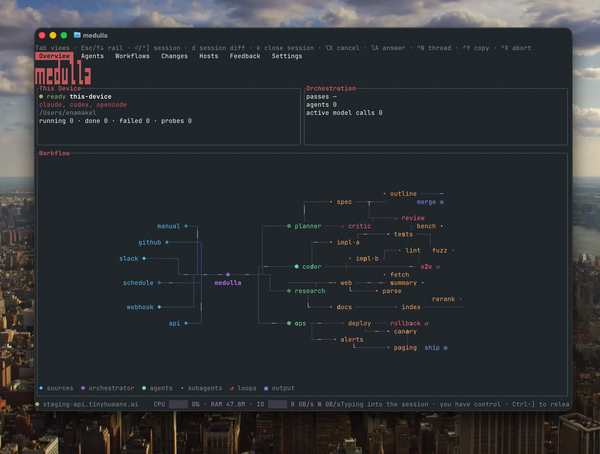

# Medulla

**One terminal. Every agent you have. Working at once.**

Claude Code, Codex, and OpenCode are very good at running one task deeply. Medulla is what runs a hundred of them. It decides what work to hand out, places each piece on an agent that can do it, streams back what every one of them is doing, and keeps a live picture of the whole operation in front of you.

Fleets with everyone.

## Why an orchestrator

Ask a coding agent to coordinate other coding agents and the same thing happens every time. The orchestrator is just another model with a transcript, and every agent it manages writes into that transcript. Accuracy falls off well before the context window fills, so an orchestrator that reads raw fleet traffic stops scaling at a handful of agents. It runs out of judgement long before it runs out of room.

A chat model manages one thread. An orchestrator has to hold an operation in its head: agents in flight, work being decomposed and delegated, results streaming back, decisions being made continuously. Medulla is built for that job instead of adapted to it.

## Install

macOS and Linux:

```sh
curl -fsSL https://raw.githubusercontent.com/tinyhumansai/medulla/main/install.sh | sh
```

Windows:

```powershell
irm https://raw.githubusercontent.com/tinyhumansai/medulla/main/install.ps1 | iex
```

Either script downloads the prebuilt binary for your platform, checks it against the release manifest, and installs it to `~/.medulla/bin` (`%USERPROFILE%\.medulla\bin` on Windows). If it updated your `PATH`, open a new terminal, or run `exec $SHELL`, so that `medulla` resolves.

Then:

```sh
medulla login   # browser sign-in
medulla         # start the orchestrator
```

Not ready to sign in? `medulla --mock` runs a full offline demo, with no account and no network.

Prebuilt binaries ship for Linux (x86_64, aarch64), macOS (Apple Silicon), and Windows (x86_64). Building from source, pinning a version, and embedding the SDK are covered in [Getting Started](https://tinyhumans.gitbook.io/medulla/developers/getting-started).

## What you get

Your whole fleet, legible. One lane per agent, live. You can see what each agent is doing, answer the one that has a question, and cancel the one that has gone wrong, without losing your place in everything else.

Any machine, in two steps. Your laptop runs work by default. To add a build box or a server, paste one line into an SSH session; it prints an address, and you paste that back.

Repositories it understands. Point Medulla at your projects once. It writes a short profile for each one and routes work by what the repository actually is, instead of guessing from a directory name.

Plans that actually run. A workflow is a saved multi-step plan whose steps each run as a real agent session, with parallel branches and approval gates where a human has to say yes. Ask for one in plain words and an agent will build it for you.

Small surface, low spend. Most of your fleet's output never reaches the orchestrator's context. It reasons over a distilled, current picture, so the volume you pay orchestrator rates on stays small however much is running underneath.

## Documentation

Full documentation lives at **[tinyhumans.gitbook.io/medulla](https://tinyhumans.gitbook.io/medulla)**.

Start with the product pages:

- [Workers and Sessions](https://tinyhumans.gitbook.io/medulla/features/workers-and-sessions): capacity, threads, and what survives a restart.
- [Workflows](https://tinyhumans.gitbook.io/medulla/features/workflows): authored multi-step plans and their runs.
- [MEDULLA.md Workspace Profiles](https://tinyhumans.gitbook.io/medulla/features/workspace-profiles): telling the orchestrator what a repository is.
- [Orchestrator Routing](https://tinyhumans.gitbook.io/medulla/features/routing): cognitive tiers, harness selection, and strategies.
- [Token Efficiency and Budgets](https://tinyhumans.gitbook.io/medulla/features/token-efficiency): small surfaces and enforced budgets.

Building on Medulla, or running it yourself? Everything technical is in [Developers](https://tinyhumans.gitbook.io/medulla/developers): the TUI, the CLI, configuration and environment variables, worker daemons, authentication, architecture, the Rust SDK, the harness contract, the host-link protocol, testing, and troubleshooting.

## Availability

Medulla is in early alpha and access is gated. It is rolling out to a small group of OpenHuman subscribers first, alongside gated API access for teams building agentic systems. Alpha partners get direct access to the team, and their workloads decide what we build next. See [Pricing and Availability](https://tinyhumans.gitbook.io/medulla/pricing-and-availability) for rates and how to ask for access.

## Open source

This repository is the Rust workspace behind the product: the [`medulla`](https://github.com/tinyhumansai/medulla/tree/main/src/sdk) SDK and the [`medulla-tui`](https://github.com/tinyhumansai/medulla/tree/main/src/tui) crate that ships the binary, both under GPL-3.0-only. The orchestrator is gated; this code is not. Read it, build it, and run the whole client offline against the mock runtime. Start with [Contributing](https://tinyhumans.gitbook.io/medulla/developers/contributing).
