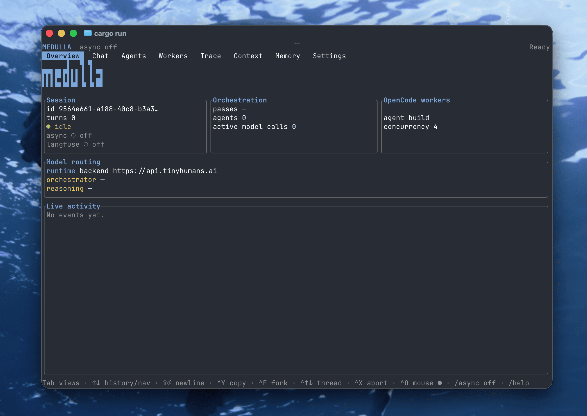

# Medulla: The Orchestrator

**One terminal. Every agent you have. Working at once.**

Claude Code, Codex, and OpenCode are remarkable at running one task deeply. Medulla is what runs a hundred of them. It decides what work to hand out, places each piece on an agent that can do it, streams back what every one of them is doing, and keeps a live picture of the whole operation in front of you.

Fleets with everyone.

## Install

**macOS and Linux**

```sh
curl -fsSL https://raw.githubusercontent.com/tinyhumansai/medulla/main/install.sh | sh
```

**Windows**

```powershell
irm https://raw.githubusercontent.com/tinyhumansai/medulla/main/install.ps1 | iex
```

Either script downloads the prebuilt binary for your platform, verifies its SHA-256 against the release manifest, and installs to `~/.medulla/bin` (`%USERPROFILE%\.medulla\bin` on Windows). If it updated your `PATH`, open a new terminal — or run `exec $SHELL` — so `medulla` resolves.

Then:

```sh
medulla login   # browser sign-in
medulla         # start the orchestrator
```

Not ready to sign in? `medulla --mock` runs a full offline demo — no account, no network.

Prebuilt binaries ship for Linux (x86\_64, aarch64), macOS (Apple Silicon), and Windows (x86\_64). Pinning a version and the SDK are covered in [Developers → Getting Started](https://tinyhumans.gitbook.io/medulla/developers/getting-started).

## What you get

**Your whole fleet, legible.** One lane per agent, live. See what each is doing, answer the one that has a question, cancel the one that has gone wrong — without losing your place in everything else.

**Any machine, in two steps.** Your laptop runs work by default. Add a build box or a server by pasting one line into an SSH session; it prints an address, you paste it back. Now the fleet is bigger.

**Repositories it understands.** Point Medulla at your projects once. It writes a short profile for each and uses it to route work to the right place, rather than guessing from a directory name.

**Plans that actually run.** A workflow is a saved, multi-step plan whose steps each run as a real agent session — with parallel branches, and approval gates where a human has to say yes. Ask for one in plain words and an agent will build it for you.

**Small surface, low spend.** The bulk of your fleet's output never reaches the orchestrator's context. It reasons over a distilled, current picture, so what you pay orchestrator rates on stays small however much is running underneath.

## Documentation

Full documentation: **[tinyhumans.gitbook.io/medulla](https://tinyhumans.gitbook.io/medulla)**

* [Workers and Sessions](https://tinyhumans.gitbook.io/medulla/features/workers-and-sessions) — capacity, threads, and what survives.
* [Workflows](https://tinyhumans.gitbook.io/medulla/features/workflows) — authored multi-step plans and their runs.
* [MEDULLA.md Workspace Profiles](https://tinyhumans.gitbook.io/medulla/features/workspace-profiles) — telling the orchestrator what a repo is.
* [Orchestrator Routing](https://tinyhumans.gitbook.io/medulla/features/routing) — cognitive tiers, harness-type selection, strategies.
* [Token Efficiency and Budgets](https://tinyhumans.gitbook.io/medulla/features/token-efficiency) — small surfaces and enforced budgets.

Building on Medulla, or running it yourself? Everything technical — the TUI in depth, the CLI, worker daemons, configuration, architecture, and the SDK — is in **[Developers](https://tinyhumans.gitbook.io/medulla/developers)**.

## Availability

Medulla is in **early alpha**, and access is gated. It is rolling out to a small group of OpenHuman subscribers first, alongside gated API access for select teams building agentic systems. Alpha partners get direct access to the team, and their workloads shape what Medulla becomes.

Request access and tell us what you are orchestrating.

## Why an orchestrator

Ask a coding agent to coordinate other coding agents and you hit the same quiet failure mode everywhere: the orchestrator is just another model with a transcript, and every agent it manages writes into that transcript. Accuracy degrades well before the context window fills. An orchestrator that reads raw fleet traffic stops scaling at a handful of agents — long before it runs out of room, it stops being able to think.

Orchestration is becoming the dominant pattern in agentic systems, yet it has been running on architectures designed for chat. A chat model manages one thread. An orchestrator has to hold an operation in its head: agents in flight, work being decomposed and delegated, results streaming back, decisions made continuously. Medulla is built for that.

## What is in this repository

This is Medulla's documentation and distribution surface:

- `docs/` — engineering specs, protocol documents, and plans.
- `gitbooks/` — the sources behind [tinyhumans.gitbook.io/medulla](https://tinyhumans.gitbook.io/medulla).
- `install.sh` / `install.ps1` — the installers the commands above run.
- **[Releases](https://github.com/tinyhumansai/medulla/releases)** — every published binary, its checksum, and the `latest.json` manifest `medulla update` reads.

The Rust workspace that produces those binaries is developed separately; its release pipeline publishes here.
